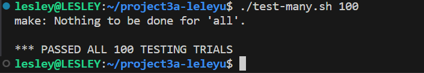

[](https://classroom.github.com/a/6FKkSJQJ)

# Locks and Condition Variables

## How to make 

示例：`counter_test`

```shell
make clean_counter
make libcounter
make counter_test
./counter_test
```

## Part 1：Spin Locks

### Data Structure

```c
typedef struct{
    volatile unsigned int flag;
}spinlock_t;
```

- `spinlock_init`：将`flag`设置为0来初始化自旋锁

- `spinlock_acquire`：使用忙等循环获取锁

  ```c
  while(xchg(&lock->flag,1)==1);
  ```

- `spinlock_release`：将`flag`设置为0来释放自旋锁，允许其他线程获取锁

## Part 2：Mutex

```c
static long sys_futex(void *addr1, int op, int val1, struct timespec *timeout, void *addr2, int val3)
{
	return syscall(SYS_futex, addr1, op, val1, timeout, addr2, val3);
}
```

- `addr1`是用户态下共享内存的地址，里面存放的是一个对齐的整型计数器。
- `op`存放操作类型，主要有两种
  1. `FUTEX_WAIT`：原子性地检查`addr1`中计数器的值是否为val，如果是则让进程休眠，直到`FUTEX_WAKE`或者`timeout`，即把集成挂到`addr1`相对应的等待队列上
  2. `FUTEX_WAKE`：最多唤醒`val1`个等待在`addr1`上的进程

### Data Structure 

```c
typedef struct{
    volatile unsigned int flag;
}mutex_t;
```

### API

- `mutex_init`：将`flag`设置为0来初始化`mutex`

- `mutex_acquire`：与`spinlock`不同的是，当锁不可用时，线程会休眠而不是等待。需要注意的是，上锁的过程必须是原子性的。

  ```c
      while(1){
          if(!xchg(&lock->flag,1)){
              break;
          }
          sys_futex((void*)&lock->flag,FUTEX_WAIT,1,NULL,NULL,0);
  ```

  > 失败尝试：
  >
  > ```c
  >     sys_futex((void*)&lock->flag,FUTEX_WAIT,1,NULL,NULL,0);
  >     lock->flag=1;
  > ```
  >
  > 这样并不能解决竞争条件,比如
  >
  > | time | P1           | P2                           | P3                          |
  > | ---- | ------------ | ---------------------------- | --------------------------- |
  > | 0    | acquire lock |                              |                             |
  > | 1    |              | wait for lock                | wait for lock               |
  > | 2    | release lock | lock available, exit waiting | lock avilable, exit waiting |
  > | 3    |              | set flag=1                   | set flag=1                  |
  >
  > 由于上锁操作的非原子性，会导致P2，P3两个线程都会获得锁，并进入临界区。

- `mutex_release`：将`flag`设置为0来释放`mutex`，并使用`futex`唤醒等待的线程。

  ```c
      lock->flag=0;
      sys_futex((void*)&lock->flag,FUTEX_WAKE,1,NULL,NULL,0);
  ```

## Part 3

### Counter

#### Data Structure 

```c
struct counter_t {
    volatile unsigned int value;
    spinlock_t spinlock;
    mutex_t mutex;
};
```

可根据需要选用不同的锁进行测试

#### API

- `counter_new`：创建一个具有初始值的新计数器，并初始化相关的锁
- `counter_destroy`：释放计数器分配的内存
- `counter_get_value`：获取计数器的当前值
- `counter_increment`：增加计数器的值
- `counter_decrement`：减少计数器的值

#### Test

测试了计数器在多线程场景中的并发使用，创建多个线程用于增加和减少计数器，并打印中间值。详情见[counter_test.c](./counter_test.c)。

### List

#### Data Structure

```c
typedef struct node_t{
    int key;
    struct node_t *next;
}node_t;
struct list_t{
    node_t *head;
    spinlock_t spinlock;
    mutex_t mutex;
};
```

#### API

- `list_new`：创建新链表
- `list_destroy`：销毁链表及其节点
- `list_insert`：在链表头部插入节点
- `list_delete`：从链表中删除特定键值的节点

#### Test

测试了链表在多线程场景中的并发使用，创建多个线程用于插入和删除链表中的节点。详情见[list_test.c](./list_test.c)。

### Hash

#### Data Structure 

```c
struct hash_t{
    int size;
    struct list_t **bucket;
};
```

#### API

- `hash_new`：根据桶的大小初始化一个哈希表，返回新创建的哈希表指针
- `hash_destroy`：释放为哈希表及其关联桶分配的内存
- `hash_insert`：将一个键值插入哈希表
- `hash_delete`：从哈希表中删除一个简直
- `hash_lookup`：在哈希表中搜索一个键

#### Test

测试了哈希表在多线程场景中的并发使用，创建多个线程，同时在哈希表中插入和删除键值，在线程完成操作后，打印每个桶的内容。详情见[hash_test.c](./hash_test.c)。

## Part 4

详情见[Report](./Report.md)

## Part 5

### Data Structure

```c
struct mq_t{
    int *buf;
    int buf_size;
    int fill_ptr;
    int use_ptr;
    int count;
    
    pthread_cond_t empty;
    pthread_cond_t fill;
    pthread_mutex_t mutex;
};
```

### API

- `mq_new`：指定缓冲区大小，初始化一个新的消息队列
- `mq_destroy`：释放为消息队列及其关联缓冲区分配的内存
- `mq_produce`：将一个项目放入消息队列
- `mq_consume`：从消息队列中获取一个项目

### Test

测试了消息队列在生产者和消费者之前的并发行为。程序创建多个生产者和消费者进程，并发地生产和消费项目，详情见[mq_test.c](./mq_test.c)。


