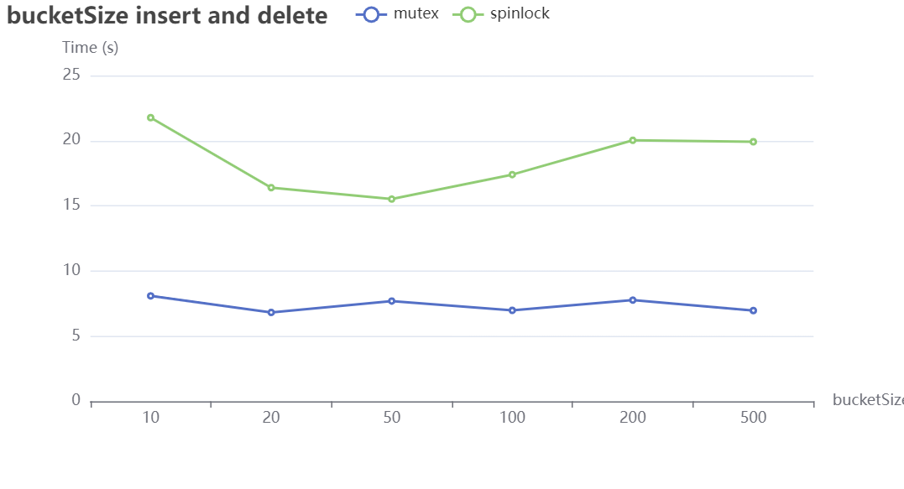

# Comparing Performance

## 1. Performance: My Locks VS pthread locks

由于`hash_t`的每个桶都是一个`list_t`，所以在实现`hash_insert`和`hash_delete`时直接使用`list_t`中的锁。

`list.c`

```c
void list_insert(struct list_t *list, int key){
    //when use spinlock
    spinlock_acquire(&(list->spinlock));
    //......
    spinlock_release(&(list->spinlock));
}
```

`hash.c`

```c
void hash_insert(struct hash_t *hash, int key){
    int h=f(key)%hash->size;
    list_insert(hash->bucket[h],key);
}
```

这样的实现已经可以保证不同进程对同一个桶的互斥操作。

因此要比较自定义的锁和`pthread`的锁的性能，只需更改`list_t`的结构，添加`pthread`的锁，并使用不同的锁测试以比较性能。

> 我的思考：不同线程对同一桶的操作已确保互斥。但如果两线程p1，p2同时调用hash_insert，p1计算完h值未调用list_insert，此时p2计算h值，是否会覆盖p1的h值，导致p1传入list_insert的是错误的h值？需不需为h值上锁？
>
> 答：关键在于h的作用域和生命周期。在多线程环境中，每线程有自己的函数调用栈，故局部变量作用域线程私有。key和h对于每线程独立。两线程同时调用hash_insert时，各自的h在各自函数栈上分配，独立且不会相互覆盖。

`list.h`

```c
struct list_t{
    node_t *head;
    spinlock_t spinlock;
    mutex_t mutex;
    pthread_mutex_t pmutex;
    pthread_spinlock_t pspin;
};
```


**analysis**

现象：在线程数量较少时，spinlock与pthread_spinlock耗时的增长速度相对一致。随着线程数量的增加，pthread_spinlock的增长速度变快，而spinlock的性能稍优于pthread_spinlock。

分析：pthread_spinlock可能涉及系统调用，在用户态和内核态之间切换，引入额外的开销。spinlock的实现(`xchg`)中使用更高效的汇编指令可能有助于提高性能。


 **analysis**

现象：mutex和pthread_mutex在不同线程数量下表现出类似的性能

分析：基于`sys_futex`的mutex实现依赖于futex系统调用，pthread_mutex也使用系统调用，二者在这方面的开销可能相近。

## 2. Performance of My Locks: Spinlock VS Mutex


 **analysis**

现象：线程数量较少时，spinlock的性能与Mutex基本一致，当线程大于14时，性能相差较大，且Mutex的性能远大于Spinlock

分析：当线程数量增加时，mutex可以让线程在锁不可用时进入休眠状态，并在锁可用时唤醒它们，从而在争用期间降低CPU使用率，更有效地管理线程，性能表现更好

## 3. Fairness of My Locks 

为了测试不同锁的公平性，设定在锁的数量一定的情况下，每个线程获得锁的次数。

- 计数器`counter`的初始值设为`EXETIME`。
- 数组`thread_get_lock`，用于跟踪每个线程成功递减计数器的次数。
- 当计数器的值<0时，所有线程都不能再获取锁。
- 线程返回，统计每个线程获取锁的次数。

通过检查所有线程是否具有大致相等的减少计数器的机会来测试计数器实现的公平性。

下面的图表展示了当锁的数量`EXETIME`为10000时，每个线程获得锁的次数。


 **analysis**

现象：**Mutex**的公平性比**Spinlock**更好

分析：

- 当一个线程获得了 Mutex 后，其他试图获得 Mutex 的线程将被阻塞，直到拥有 Mutex 的线程释放它。而Mutex使用系统调用来实现等待和唤醒线程，以确保线程在等待时不会占用处理器资源

+ Spinlock通过循环自旋的方式尝试获取锁。如果锁被其他线程持有，当前线程会一直处于忙等待状态，不会被挂起。

## 4. Given a bucket size, Performance of one type of operations: hash_lookup, hash_insert, hash_delete

+ ### Mutex

以下为hashtable的`bucket_size`设定为200，不同数量的线程执行`10000`次操作的耗时


 **analysis**

现象：查找和删除操作的耗时**远大于**插入操作，且查找与删除的耗时近乎**相同**

分析：

+ 插入操作只需将新节点放至`list->head`的位置，过程简单
+ 查找和删除操作需要对`list`进行**遍历**，两个操作的过程几乎相同

现象：在线程数为18时，有比较明显的**耗时回落**现象

分析：这种情况可能与系统资源管理有关。当线程数量达到系统资源的限制（比如处理器核心数）时，18个线程可能已经达到了系统能够有效处理的极限。此时，可能引起调度器的重新分配，使得资源分配更为有效，从而导致耗时下降。

+ ### Spinlock

以下为hashtable的`bucket_size`设定为200，`4~20`个线程执行`10000`次操作的耗时


 **analysis**

现象：线程数量与耗时间的增量关系**不稳定**

分析：使用**spinlock**时，可能会有锁长期处于自旋状态，耗时变得不稳定

现象：相对于**Mutex**，使用**Spinlock**时，删除与查看的耗时并不同步，甚至删除的耗时远大于查看操作

分析：

+ 不同步的原因：TODO
+ 删除操作不仅涉及对数据结构的访问，还需要对资源进行释放和清理，如内存释放、指针的重新连接等，相对于简单的查看操作来说，耗时更长。

## 5. Given a bucket size, Performance of conducting both hash_lookup and hash_insert

当`bucket_size`设定为200时，`4~20`个线程执行`10000`次操作的耗时


**analysis** 

1. Mutex的耗时**大于**spinlock的耗时

2. Mutex除了在线程为18时有明显的回落，状态下基本呈现线性增长


## 6. A hash table scaling test

当线程为`20`时，执行插入`150000`次时，`bucket_size`分别为`10`, `20`, `50`, `100`, `200`, `500`的耗时

以下为仅测试insert的情况


当线程为`20`时，执行插入和删除次数`10000`次时，`bucketSize`分别为`10`, `20`, `50`, `100`, `200`, `500`的耗时

以下为测试 `insert and delete`的情况



**analysis**

现象：总体上，`spinlock`的耗时比`mutex`更长。bucketSize对耗时的影响并不大。

分析：有可能是因为哈希函数的性能较好，所以不同线程计算得到的哈希值重复率较小，因此不同线程对同一个桶的竞争较小。

现象：spinlock在执行第一次测试时，耗时总会特别长

分析：TODO

> 玄学，今日复测多次，结果却极其平均